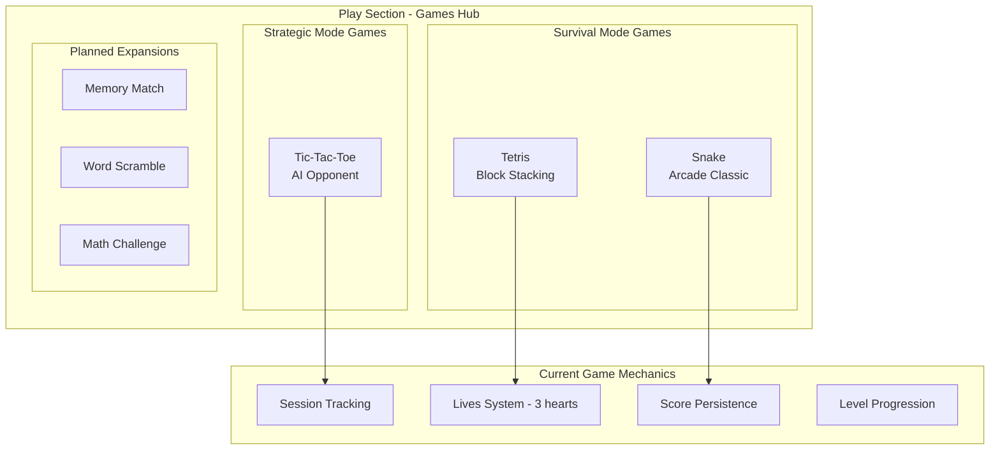
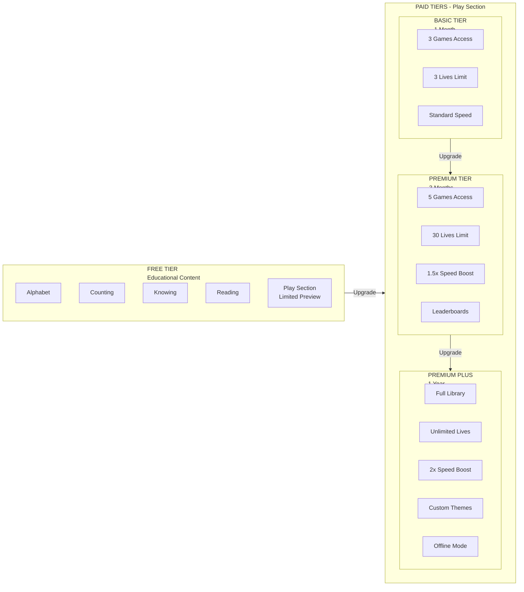
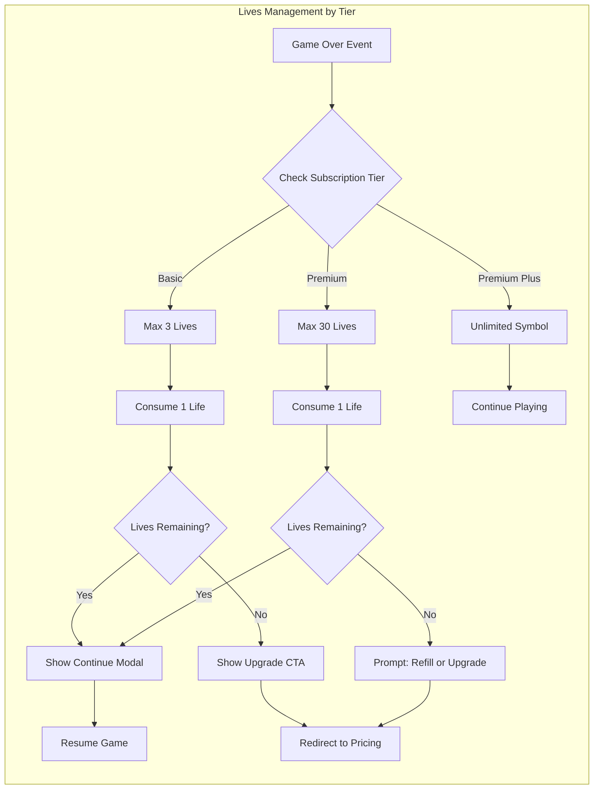
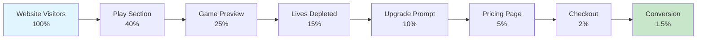
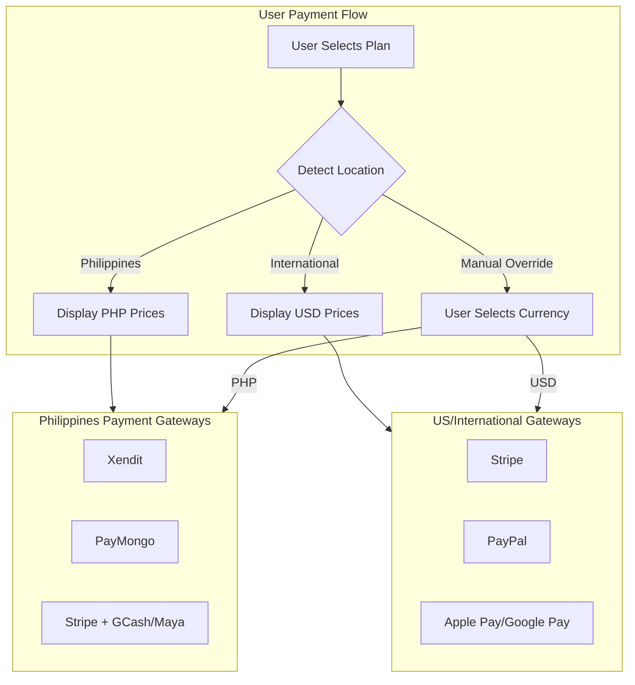
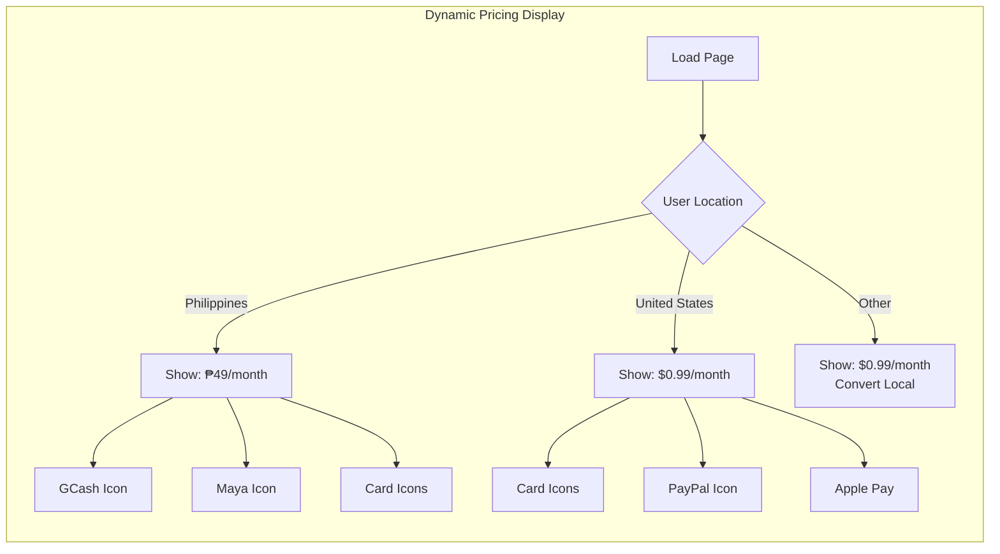
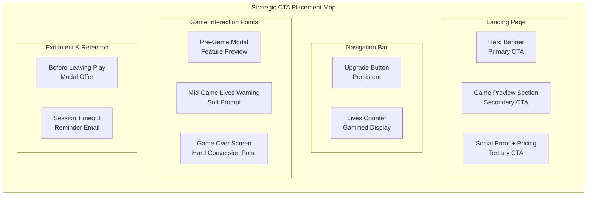
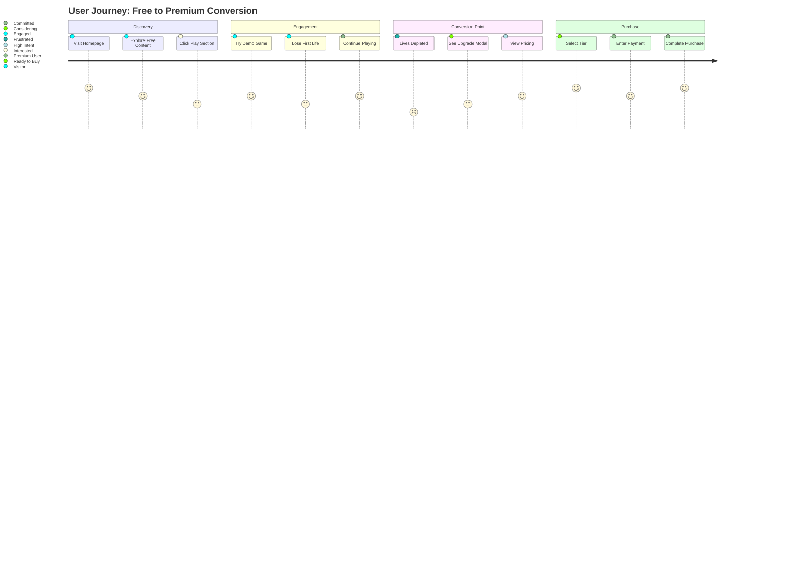
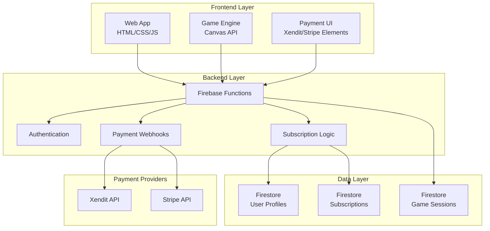

# Edulift Gaming Platform: Subscription Monetization Strategy

## Executive Summary

This document outlines a comprehensive subscription-based monetization strategy for the Edulift gaming platform. The strategy focuses on freemium access to educational content while implementing a tiered subscription model for the "Play" section, featuring dynamic pricing, dual-currency support (PHP/USD), and strategic UI/UX placement to maximize conversion rates.

---

## 1. Current Website Analysis

### 1.1 Platform Overview

Edulift is an educational web platform targeting non-readers and early learners, structured with the following components:

| Section | Content Type | Current Access | Target Audience |
|---------|-------------|----------------|-----------------|
| **Alphabet** | Letter learning, phonics | Free | Beginners |
| **Counting** | Numbers, arithmetic | Free | Early learners |
| **Knowing** | Concepts, science, nature | Free | Curious learners |
| **Reading** | English, Filipino, Abakada | Free | Literacy development |
| **Play** | Tetris, Tic-Tac-Toe, Snake | **Subscription** | Gamified learning |

### 1.2 Game Inventory Analysis



### 1.3 Technical Stack

- **Frontend**: HTML5, CSS3, Vanilla JavaScript
- **Authentication**: Firebase Authentication
- **Database**: Firebase Realtime Database
- **Hosting**: Firebase Hosting
- **Current State**: Client-side game logic, no backend subscription validation

---

## 2. Subscription Tier Architecture

### 2.1 Freemium Model Structure



### 2.2 Detailed Tier Specifications

#### Tier 1: Basic Player
**Duration**: 1 Month | **Target**: Casual gamers, trial users

| Feature | Specification |
|---------|--------------|
| **Game Access** | Tetris, Tic-Tac-Toe, Snake (3 games) |
| **Lives System** | 3 lives per game session |
| **Session Length** | Unlimited sessions |
| **Save Progress** | Local storage only |
| **Leaderboards** | Not included |
| **Multiplayer** | Not included |
| **Speed/Difficulty** | Standard levels only |

#### Tier 2: Premium Player
**Duration**: 3 Months | **Target**: Regular players, students

| Feature | Specification |
|---------|--------------|
| **Game Access** | All Basic games + 2 additional games |
| **Lives System** | 30 lives per game session |
| **Session Length** | Unlimited sessions |
| **Save Progress** | Cloud sync across devices |
| **Leaderboards** | Global + Friends rankings |
| **Multiplayer** | Turn-based async multiplayer |
| **Speed/Difficulty** | 1.5x speed boost unlock |
| **Exclusive Content** | Weekly challenges |

#### Tier 3: Premium Plus
**Duration**: 1 Year | **Target**: Power users, families

| Feature | Specification |
|---------|--------------|
| **Game Access** | Full library + early access to new games |
| **Lives System** | Unlimited lives |
| **Session Length** | Unlimited |
| **Save Progress** | Cloud sync + export capability |
| **Leaderboards** | All tiers + tournament access |
| **Multiplayer** | Real-time multiplayer |
| **Speed/Difficulty** | 2x speed boost + custom modifiers |
| **Exclusive Content** | Beta access, custom themes |
| **Offline Mode** | Download games for offline play |
| **Family Sharing** | Up to 4 sub-accounts |

### 2.3 Lives System Implementation Matrix



---

## 3. Market Research & Pricing Strategy

### 3.1 Competitive Analysis

Based on current market data for casual browser-based gaming platforms (2024-2025):

| Platform | Model | Price Range | Key Features |
|----------|-------|-------------|--------------|
| **CrazyGames** | Ad-supported + Premium | $4.99/mo | Remove ads, exclusive games |
| **Poki** | Free-to-play | N/A | Ad revenue model |
| **CoolMath Games** | Free + Premium | $5.99/mo | Ad-free, full screen |
| **Kongregate** | Free + Kartridge | Variable | Achievement system |
| **Pogo** | EA Play subscription | $4.99/mo | Classic games, no ads |
| **Solitaired** | Premium tiers | $2.99-$9.99 | Stats tracking, themes |

### 3.2 Regional Pricing Strategy

#### Philippine Market (PHP)
- **Economic Context**: Average monthly disposable income varies significantly
- **Price Sensitivity**: High - casual gamers prefer affordable micro-transactions
- **Popular Models**: GCash integration essential, weekly/monthly plans preferred

#### US Market (USD)
- **Economic Context**: Higher disposable income, subscription fatigue awareness
- **Price Sensitivity**: Medium - value-focused pricing required
- **Popular Models**: Annual discounts, family plans, free trials

### 3.3 Recommended Price Points

#### Growth-Oriented Pricing Strategy

| Tier | Duration | PHP Price | USD Price | Value Proposition |
|------|----------|-----------|-----------|-------------------|
| **Basic** | 1 Month | ₱49 | $0.99 | Entry-level, low commitment |
| **Basic** | 3 Months | ₱129 | $2.49 | 12% savings vs monthly |
| **Premium** | 3 Months | ₱199 | $3.99 | Best value for regular players |
| **Premium** | 6 Months | ₱349 | $6.99 | 13% additional savings |
| **Premium Plus** | 1 Year | ₱599 | $11.99 | 75% savings vs monthly Basic |

#### Psychological Pricing Tactics

1. **Charm Pricing**: End prices in .99 (₱49, $0.99) for perceived value
2. **Anchoring**: Display yearly savings prominently
3. **Decoy Effect**: Position Premium 3-month as the "most popular"
4. **Trial Period**: 7-day free trial for all tiers
5. **Student Discount**: 20% off with .edu verification

### 3.4 Conversion Funnel Projections



---

## 4. Payment Gateway Integration

### 4.1 Dual-Currency Support Architecture



### 4.2 Recommended Payment APIs

#### Primary Gateway: Xendit (Philippines + International)

**Why Xendit:**
- Native PHP support with competitive rates
- Supports GCash, Maya, GrabPay, 7-Eleven payments
- International card processing (Visa, Mastercard, Amex)
- Built-in subscription management
- PCI-DSS Level 1 compliant

**Supported Methods:**
| Method | PHP | USD | Type |
|--------|-----|-----|------|
| GCash | ✓ | ✗ | E-wallet |
| Maya | ✓ | ✗ | E-wallet |
| GrabPay | ✓ | ✗ | E-wallet |
| Credit/Debit Cards | ✓ | ✓ | Card |
| 7-Eleven | ✓ | ✗ | OTC |
| BPI/BDO Online | ✓ | ✗ | Bank |
| PayPal | ✓ | ✓ | Wallet |

**Pricing:**
- Cards: 3.5% + ₱15 per transaction
- E-wallets: 2.5% per transaction
- OTC: 2% + ₱15 per transaction

#### Secondary Gateway: Stripe (International Focus)

**Why Stripe:**
- Gold standard for international payments
- Excellent developer experience
- Subscription billing with Stripe Billing
- Support for 135+ currencies
- Advanced fraud protection

**Supported Methods:**
| Method | PHP | USD | Type |
|--------|-----|-----|------|
| Credit/Debit Cards | ✓ | ✓ | Card |
| Apple Pay | ✓ | ✓ | Wallet |
| Google Pay | ✓ | ✓ | Wallet |
| PayPal | ✓ | ✓ | Wallet |
| Buy Now Pay Later | ✗ | ✓ | Financing |

**Pricing:**
- Online payments: 2.9% + $0.30 per transaction
- Subscription billing: 0.5% on recurring payments

### 4.3 Unified Checkout Implementation Strategy

#### Currency Detection Logic

```javascript
// Pseudo-code for currency detection
function detectCurrencyAndMethods() {
    // Priority 1: User preference (stored in localStorage/cookie)
    const userPreference = getUserCurrencyPreference();
    if (userPreference) return userPreference;
    
    // Priority 2: IP-based geolocation
    const userCountry = getCountryFromIP();
    if (userCountry === 'PH') {
        return { currency: 'PHP', gateway: 'xendit', methods: ['gcash', 'maya', 'card'] };
    }
    
    // Priority 3: Browser locale
    const locale = navigator.language;
    if (locale.includes('en-PH') || locale.includes('fil')) {
        return { currency: 'PHP', gateway: 'xendit', methods: ['gcash', 'maya', 'card'] };
    }
    
    // Default: USD for international
    return { currency: 'USD', gateway: 'stripe', methods: ['card', 'paypal', 'apple_pay'] };
}
```

#### Dynamic Pricing Display



### 4.4 Regional Payment Methods Deep Dive

#### Philippines - E-wallet First Strategy

| Method | Market Share | Implementation Priority |
|--------|-------------|------------------------|
| **GCash** | 45% | P0 - Must have |
| **Maya** | 25% | P0 - Must have |
| **GrabPay** | 15% | P1 - Nice to have |
| **Credit Cards** | 10% | P1 - Standard support |
| **OTC (7-Eleven)** | 5% | P2 - Accessibility option |

#### United States - Card + Wallet Strategy

| Method | Market Share | Implementation Priority |
|--------|-------------|------------------------|
| **Credit/Debit Cards** | 65% | P0 - Must have |
| **PayPal** | 20% | P0 - Must have |
| **Apple Pay** | 10% | P1 - iOS users |
| **Google Pay** | 4% | P1 - Android users |
| **Buy Now Pay Later** | 1% | P2 - Future consideration |

---

## 5. UI/UX Placement Strategy

### 5.1 High-Converting CTA Locations



### 5.2 Detailed CTA Specifications

#### 1. Landing Page Hero Section
**Location**: [`index.html`](index.html:52) - Hero section
**Type**: Primary CTA
**Design**: 
- Button: "Start Playing - Free Trial"
- Color: Gradient from #ff6b6b to #ff8e8e
- Animation: Subtle pulse on load
- Position: Center-aligned below subtitle

**Conversion Goal**: 5% click-through rate

#### 2. Navigation Bar Upgrade Button
**Location**: Persistent across all pages
**Type**: Persistent micro-conversion
**Design**:
- Icon: Crown or gem icon
- Text: "Upgrade" or "Get Premium"
- Badge: Show current tier if subscribed
- Hover: Dropdown with tier comparison

**Conversion Goal**: 2% of page views

#### 3. Game Hub Preview Cards
**Location**: [`play/index.html`](play/index.html:163) - Game cards
**Type**: Contextual CTA
**Design**:
- Locked games: Overlay with lock icon
- Tooltip: "Upgrade to unlock"
- Preview: 30-second demo playable

**Conversion Goal**: 8% of game preview interactions

#### 4. Lives Depletion Modal
**Location**: Triggered on game over
**Type**: Conversion-critical modal
**Design**:
- Emotional hook: "Don't lose your progress!"
- Urgency: "Get 30 more lives now"
- Options: Watch ad (free), Upgrade, Buy lives (micro-transaction)

**Conversion Goal**: 15% of game over events

#### 5. Exit Intent Modal
**Location**: Mouse leave detection on Play section
**Type**: Retention CTA
**Design**:
- Offer: "Wait! Get 50% off your first month"
- Timer: Countdown for urgency
- Dismiss: Easy close to avoid frustration

**Conversion Goal**: 3% of exit intents

### 5.3 User Journey Mapping



---

## 6. Technical Implementation Roadmap

### 6.1 System Architecture



### 6.2 Implementation Phases

#### Phase 1: Foundation (Weeks 1-2)
- [ ] Set up Firebase project structure
- [ ] Implement user authentication enhancements
- [ ] Create subscription data models
- [ ] Build basic subscription status API

#### Phase 2: Payment Integration (Weeks 3-4)
- [ ] Integrate Xendit PHP gateway
- [ ] Integrate Stripe USD gateway
- [ ] Implement webhook handlers
- [ ] Create checkout flow UI

#### Phase 3: Lives System Backend (Weeks 5-6)
- [ ] Refactor game logic for server-side validation
- [ ] Implement lives consumption API
- [ ] Create tier-based limits enforcement
- [ ] Build admin dashboard for monitoring

#### Phase 4: UI/UX Implementation (Weeks 7-8)
- [ ] Design and implement upgrade modals
- [ ] Create pricing page
- [ ] Add navigation CTAs
- [ ] Implement game preview system

#### Phase 5: Testing & Launch (Weeks 9-10)
- [ ] End-to-end payment testing
- [ ] Security audit
- [ ] Beta launch with limited users
- [ ] Full production launch

### 6.3 Database Schema

```javascript
// User Subscription Schema
{
  userId: "string",
  subscription: {
    tier: "basic" | "premium" | "premium_plus",
    status: "active" | "cancelled" | "expired",
    startDate: "timestamp",
    endDate: "timestamp",
    autoRenew: boolean,
    paymentMethod: {
      gateway: "xendit" | "stripe",
      type: "card" | "gcash" | "maya" | "paypal",
      last4: "string",
      expiryMonth: number,
      expiryYear: number
    }
  },
  gameStats: {
    tetris: {
      totalGames: number,
      highScore: number,
      livesConsumed: number,
      sessions: []
    },
    tictactoe: {
      wins: number,
      losses: number,
      draws: number
    }
  },
  lives: {
    tetris: {
      current: number,
      max: number,
      lastRefill: "timestamp"
    },
    tictactoe: {
      current: number,
      max: number,
      lastRefill: "timestamp"
    }
  }
}

// Subscription Plans Schema
{
  plans: [
    {
      id: "basic_monthly",
      name: "Basic",
      duration: "1_month",
      prices: {
        PHP: 4900,  // stored in cents
        USD: 99     // stored in cents
      },
      features: {
        games: ["tetris", "tictactoe", "snake"],
        lives: 3,
        leaderboards: false,
        offlineMode: false
      }
    },
    {
      id: "premium_quarterly",
      name: "Premium",
      duration: "3_months",
      prices: {
        PHP: 19900,
        USD: 399
      },
      features: {
        games: ["tetris", "tictactoe", "snake", "memory", "puzzle"],
        lives: 30,
        leaderboards: true,
        offlineMode: false
      }
    },
    {
      id: "premium_plus_yearly",
      name: "Premium Plus",
      duration: "1_year",
      prices: {
        PHP: 59900,
        USD: 1199
      },
      features: {
        games: "all",
        lives: "unlimited",
        leaderboards: true,
        offlineMode: true,
        familySharing: 4
      }
    }
  ]
}
```

---

## 7. Backend Logic for Lives Management

### 7.1 Lives System Flow

```mermaid
flowchart TD
    subgraph GameSession["Game Session Lifecycle"]
        A[Start Game] --> B{Check Subscription}
        
        B -->|No Subscription| C[Show Paywall]
        B -->|Active Subscription| D[Load Lives from DB]
        
        C -->|Trial Available| E[Offer Free Trial]
        C -->|No Trial| F[Redirect to Pricing]
        
        E -->|Accepted| G[Start Trial + Game]
        E -->|Declined| F
        
        D --> H[Initialize Game with Lives]
        G --> H
        
        H --> I[Game in Progress]
        I --> J[Life Lost Event]
        
        J --> K[Update Lives in DB]
        K --> L{Lives Remaining?}
        
        L -->|Yes| M[Show Continue Option]
        L -->|No| N[Game Over]
        
        M --> I
        N --> O{Check Tier}
        
        O -->|Premium Plus| P[Auto-Refill Unlimited]
        O -->|Other| Q[Show Upgrade Modal]
        
        P --> I
        Q --> R[User Decision]
        
        R -->|Upgrade| S[Redirect to Checkout]
        R -->|Refill| T[Microtransaction Purchase]
        R -->|Quit| U[Return to Hub]
    end
```



### 7.2 Lives Management API

#### Initialize Game Session
```javascript
// POST /api/game/init
{
  gameId: "tetris",
  userId: "user_123"
}

// Response
{
  success: true,
  sessionId: "session_456",
  lives: {
    current: 3,
    max: 3,
    unlimited: false
  },
  tier: "basic",
  expiresAt: "2025-04-05T00:00:00Z"
}
```

#### Consume Life
```javascript
// POST /api/game/consume-life
{
  sessionId: "session_456",
  gameId: "tetris"
}

// Response - Lives Remaining
{
  success: true,
  lives: {
    current: 2,
    max: 3,
    unlimited: false
  },
  canContinue: true
}

// Response - No Lives Left
{
  success: true,
  lives: {
    current: 0,
    max: 3,
    unlimited: false
  },
  canContinue: false,
  options: ["upgrade", "refill", "watch_ad"]
}
```

#### Refill Lives (Microtransaction)
```javascript
// POST /api/game/refill
{
  gameId: "tetris",
  refillType: "instant" | "daily" | "unlimited"
}

// Pricing
// Instant: ₱10 / $0.20 for 3 lives
// Daily: ₱30 / $0.50 for 24hr unlimited
// Unlimited: Tier upgrade only
```

### 7.3 Tier-Based Lives Configuration

```javascript
// Lives configuration by tier
const LIVES_CONFIG = {
  free: {
    tetris: { max: 0, type: "none" },
    tictactoe: { max: 0, type: "none" },
    snake: { max: 0, type: "none" }
  },
  basic: {
    tetris: { max: 3, type: "limited", refillRate: "1_per_hour" },
    tictactoe: { max: 3, type: "limited", refillRate: "1_per_hour" },
    snake: { max: 3, type: "limited", refillRate: "1_per_hour" }
  },
  premium: {
    tetris: { max: 30, type: "limited", refillRate: "5_per_hour" },
    tictactoe: { max: 30, type: "limited", refillRate: "5_per_hour" },
    snake: { max: 30, type: "limited", refillRate: "5_per_hour" }
  },
  premium_plus: {
    tetris: { max: null, type: "unlimited" },
    tictactoe: { max: null, type: "unlimited" },
    snake: { max: null, type: "unlimited" }
  }
};

// Lives consumption logic
async function consumeLife(userId, gameId) {
  const userSub = await getUserSubscription(userId);
  const config = LIVES_CONFIG[userSub.tier][gameId];
  
  if (config.type === "unlimited") {
    return { success: true, unlimited: true };
  }
  
  const currentLives = await getCurrentLives(userId, gameId);
  
  if (currentLives > 0) {
    await decrementLives(userId, gameId, 1);
    return { 
      success: true, 
      livesRemaining: currentLives - 1,
      maxLives: config.max 
    };
  } else {
    return { 
      success: false, 
      error: "NO_LIVES_REMAINING",
      options: getRefillOptions(userSub.tier)
    };
  }
}
```

### 7.4 Client-Side Validation

```javascript
// Client-side lives manager
class LivesManager {
  constructor(userTier, gameId) {
    this.tier = userTier;
    this.gameId = gameId;
    this.lives = 0;
    this.unlimited = false;
  }
  
  async initialize() {
    const response = await fetch('/api/game/init', {
      method: 'POST',
      body: JSON.stringify({ gameId: this.gameId })
    });
    const data = await response.json();
    
    this.lives = data.lives.current;
    this.unlimited = data.lives.unlimited;
    this.updateUI();
  }
  
  async consumeLife() {
    if (this.unlimited) return true;
    
    const response = await fetch('/api/game/consume-life', {
      method: 'POST',
      body: JSON.stringify({ gameId: this.gameId })
    });
    const data = await response.json();
    
    if (data.success) {
      this.lives = data.lives.current;
      this.updateUI();
      return data.canContinue;
    } else {
      this.showUpgradeModal(data.options);
      return false;
    }
  }
  
  updateUI() {
    const heartsContainer = document.getElementById('livesDisplay');
    if (this.unlimited) {
      heartsContainer.innerHTML = '∞ Unlimited';
    } else {
      heartsContainer.innerHTML = '❤️'.repeat(this.lives) + '🖤'.repeat(this.maxLives - this.lives);
    }
  }
}
```

---

## 8. Security & Fraud Prevention

### 8.1 Subscription Validation

All subscription status checks must be server-side:

```javascript
// Secure middleware for game access
function requireSubscription(tier = 'basic') {
  return async (req, res, next) => {
    const userId = req.user.uid;
    const subscription = await getSubscription(userId);
    
    if (!subscription || subscription.status !== 'active') {
      return res.status(403).json({ error: 'SUBSCRIPTION_REQUIRED' });
    }
    
    const tierLevels = { basic: 1, premium: 2, premium_plus: 3 };
    if (tierLevels[subscription.tier] < tierLevels[tier]) {
      return res.status(403).json({ 
        error: 'TIER_UPGRADE_REQUIRED',
        currentTier: subscription.tier,
        requiredTier: tier
      });
    }
    
    next();
  };
}
```

### 8.2 Payment Security Checklist

- [ ] All payment processing via HTTPS only
- [ ] PCI-DSS compliance via hosted fields (Stripe Elements/Xendit Checkout)
- [ ] Webhook signature verification
- [ ] Idempotency keys for payment requests
- [ ] Rate limiting on payment endpoints
- [ ] Fraud detection rules (velocity checks, IP blocking)

---

## 9. Success Metrics & KPIs

### 9.1 Primary Metrics

| Metric | Target | Measurement |
|--------|--------|-------------|
| **Free-to-Paid Conversion** | 3% | Paid users / Total registered |
| **Trial-to-Paid Conversion** | 25% | Paid from trial / Total trials |
| **Monthly Churn Rate** | <5% | Cancelled / Total active |
| **Average Revenue Per User** | ₱150/$3 | Monthly recurring revenue / Users |
| **Lifetime Value** | ₱900/$18 | ARPU × Average retention months |

### 9.2 Secondary Metrics

| Metric | Target | Purpose |
|--------|--------|---------|
| **Game Session Length** | >10 min | Engagement indicator |
| **Lives Consumption Rate** | 15/day | Usage intensity |
| **Upgrade Prompt CTR** | 10% | CTA effectiveness |
| **Payment Success Rate** | >95% | Technical performance |
| **Customer Support Tickets** | <2% | User satisfaction |

---

## 10. Implementation Checklist

### Pre-Launch Requirements

- [ ] Business registration for payment processing
- [ ] Privacy policy and terms of service updates
- [ ] Refund policy documentation
- [ ] Customer support email/chat setup
- [ ] Analytics and tracking implementation
- [ ] A/B testing framework setup

### Technical Requirements

- [ ] Firebase Blaze plan (for Cloud Functions)
- [ ] Xendit account + API keys
- [ ] Stripe account + API keys
- [ ] SSL certificate (Let's Encrypt or custom)
- [ ] Webhook endpoint configuration
- [ ] Database indexing for subscription queries

### Marketing Assets

- [ ] Pricing page design and copy
- [ ] Upgrade modal designs
- [ ] Email templates (welcome, renewal, cancellation)
- [ ] Social media announcement graphics
- [ ] Tutorial videos for subscription features

---

## 11. Conclusion

This subscription monetization strategy provides Edulift with a sustainable revenue model while maintaining accessibility for educational content. The three-tier structure offers clear value progression, and the dual-currency payment system ensures broad market coverage in both the Philippines and international markets.

Key success factors:
1. **Smooth onboarding** with clear free trial communication
2. **Strategic CTA placement** without disrupting user experience
3. **Reliable payment processing** with local payment method support
4. **Fair lives system** that encourages upgrades without frustration
5. **Continuous optimization** based on analytics and user feedback

---

## Appendix A: Pricing Table Summary

| Tier | Duration | PHP | USD | Lives | Games |
|------|----------|-----|-----|-------|-------|
| **Free** | Unlimited | Free | Free | 0 (Preview only) | Demo only |
| **Basic** | 1 Month | ₱49 | $0.99 | 3 | 3 |
| **Basic** | 3 Months | ₱129 | $2.49 | 3 | 3 |
| **Premium** | 3 Months | ₱199 | $3.99 | 30 | 5 |
| **Premium** | 6 Months | ₱349 | $6.99 | 30 | 5 |
| **Premium Plus** | 1 Year | ₱599 | $11.99 | Unlimited | All |

## Appendix B: Payment API Summary

| Gateway | Best For | PHP | USD | Key Methods |
|---------|----------|-----|-----|-------------|
| **Xendit** | Philippines | ✓ | ✓ | GCash, Maya, Cards, OTC |
| **Stripe** | International | ✓ | ✓ | Cards, PayPal, Apple/Google Pay |

## Appendix C: Game Access Matrix

| Game | Free | Basic | Premium | Premium Plus |
|------|------|-------|---------|--------------|
| Tetris | Demo | Full | Full | Full |
| Tic-Tac-Toe | Demo | Full | Full | Full |
| Snake | Demo | Full | Full | Full |
| Memory Match | Locked | Locked | Full | Full |
| Word Scramble | Locked | Locked | Full | Full |
| Math Challenge | Locked | Locked | Locked | Full |
| Future Games | Locked | Locked | Locked | Early Access |

---

*Document Version: 1.0*
*Last Updated: March 2025*
*Prepared by: Senior Web Architect & Monetization Strategist*
